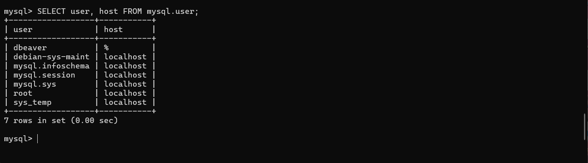
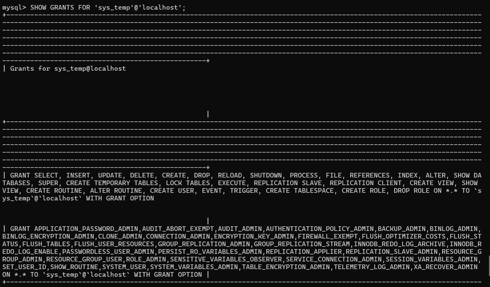
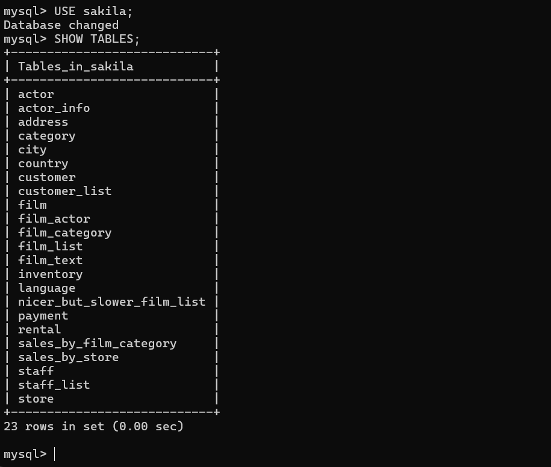
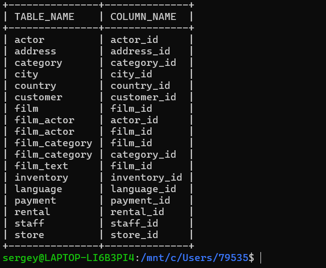

# Домашнее задание к занятию «Работа с данными (DDL/DML)»

**Подготовил:** Овсянников Сергей

---

## Задание 1

### 1.1. Поднятие чистого инстанса MySQL 8.0+
Установлен MySQL 8.0.44 в WSL Ubuntu 24.04

### 1.2. Создание учётной записи sys_temp
sql
CREATE USER 'sys_temp'@'localhost' IDENTIFIED BY 'temp_password';

1.3. Список пользователей в базе данных

1.4. Выдача всех прав пользователю sys_temp

GRANT ALL PRIVILEGES ON *.* TO 'sys_temp'@'localhost' WITH GRANT OPTION;
FLUSH PRIVILEGES;

1.5. Права пользователя sys_temp

1.6. Переподключение к базе данных от имени sys_temp

mysql -u sys_temp -ptemp_password

Для смены типа аутентификации с sha2 использован запрос:

ALTER USER 'sys_temp'@'localhost' IDENTIFIED WITH mysql_native_password BY 'temp_password';

1.7. Скачивание дампа базы данных sakila

wget https://downloads.mysql.com/docs/sakila-db.zip

unzip sakila-db.zip

1.8. Восстановление дампа и список таблиц базы данных

SOURCE sakila-db/sakila-schema.sql;

SOURCE sakila-db/sakila-data.sql;

USE sakila;

SHOW TABLES;

## Задание 2

### Таблица первичных ключей базы данных sakila

*Полный список таблиц и их первичных ключей смотрите на скриншоте выше.*

**Файл с таблицей:** [primary_keys_table.md](primary_keys_table.md)

---

## Файлы проекта

- [README.md](README.md)
- [primary_keys.txt](primary_keys.txt)
- [primary_keys_table.md](primary_keys_table.md)
- [scripts/all_queries.sql](scripts/all_queries.sql)
- [screenshots/1.3_users.png](screenshots/1.3_users.png)
- [screenshots/1.5_grants.png](screenshots/1.5_grants.png)
- [screenshots/1.8_tables.png](screenshots/1.8_tables.png)
- [screenshots/2.0_primary_keys.png](screenshots/2.0_primary_keys.png)

---

## Технические детали

- **ОС:** Windows 11 + WSL2 (Ubuntu 24.04)
- **MySQL:** Версия 8.0.44
- **База данных:** Sakila (учебная база данных MySQL)
- **Дата выполнения:** 22 января 2026 года

---

## SQL запросы
Все выполненные SQL запросы находятся в файле: [scripts/all_queries.sql](scripts/all_queries.sql)
